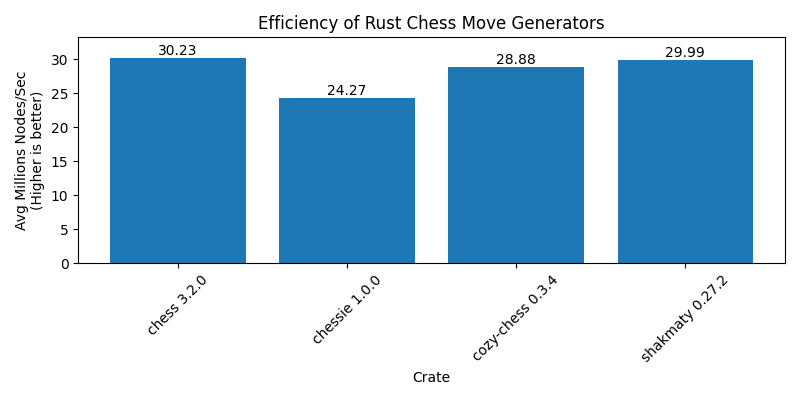

# Chessie Benchmarks

A repository to benchmark a few Rust Chess crates against my own, [`chessie`](https://crates.io/crates/chessie).

## Latest

The latest benchmark is:

As you can see, I've still got more work to do!

## Overview

The benchmarks are performed as follows:

-   I implement a generic trait on each crate's main "board" type for methods like `Board::from_fen` and `Board::make_move`.
-   Each crate undergoes a [perft suite](./src/standard.epd), executing a perft across each of the supplied depths.
-   I record how long each crate takes to perform the full perft.
-   At the end, I average the performance of each crate across all positions and compute an average metric of "millions of nodes searched per second"
-   Data is graphed!

I am aware this is not a _great_ way of benchmarking, but it gets the job done and gives me a point of reference.
If you have suggestions for how I can improve the benchmarking process, I'd love to hear them!
